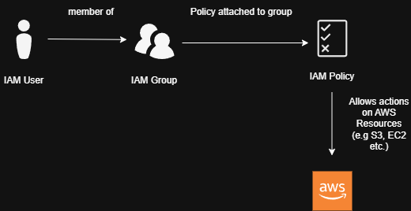

# aws-architectures

# AWS Architecture Diagrams

This repository contains simple AWS architecture diagrams demonstrating cloud fundamentals, security best practices, and operational thinking.

## Static Website Hosting on AWS

**Purpose**  
Host a static website with low cost, high availability, and global performance.

**Key services**  
Amazon S3 stores static files. CloudFront provides HTTPS and caching. Route 53 manages DNS. Access to S3 is restricted using CloudFront Origin Access Control (OAC) and an S3 bucket policy.

**Trade-off**  
This design does not support server-side logic but keeps operational complexity very low.

## IAM Permission Flow

**Purpose**  
Shows how an IAM User as part of an IAM Group is allowed to make actions with AWS Resources

**How it works**  
An IAM user is part of a defined IAM Group. The IAM Group has a policy attached to it, which in turn applies to all Users within that group. The Policies define what the Users in that Group are allowed to interact with, in terms of AWS Resources.

**Key principle**  
Access is granted by the principle of least privilege, and reviewed upon request of new permissons (and also intermittently.)
